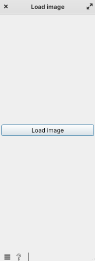
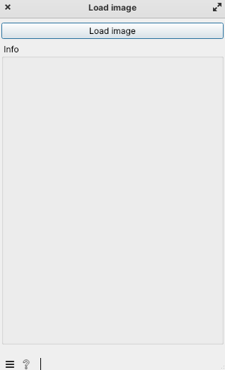

=================
Basic UI elements
=================

Main Area
=========

Widgets have a divided layout with distinct left and right sections.
By setting main_area to False, we're simply disabling one side.

.. code-block:: python

    want_main_area = False

.. raw:: html

   

      

         <figcaption>Here we see both sides</figcaption>
         
      

      

         <figcaption>When we set main area to false</figcaption>
         
      

   

|
Button
======
First, we need to import the ``Orange GUI library`` because it provides essential components for implementing various elements, such as buttons and widget boxes.

.. code-block:: python

    from Orange.widgets import gui

Now we define the button:

.. code-block:: python

        def __init__(self):
            super().__init__()

            gui.button(self.controlArea, self, label="Load image")

When we run the file, we see this output:

|
Box
===

Now, we will implement a Widget Box, which is also part of this library. We will add this code directly under the button implementation.

.. code-block:: python

        box = gui.widgetBox(self.controlArea, "Info")
        self.label = gui.widgetLabel(box, "", labelWidth=300)

|

.. seealso::
   - 🔍 :doc:`fileUploadAndBrowsing`

